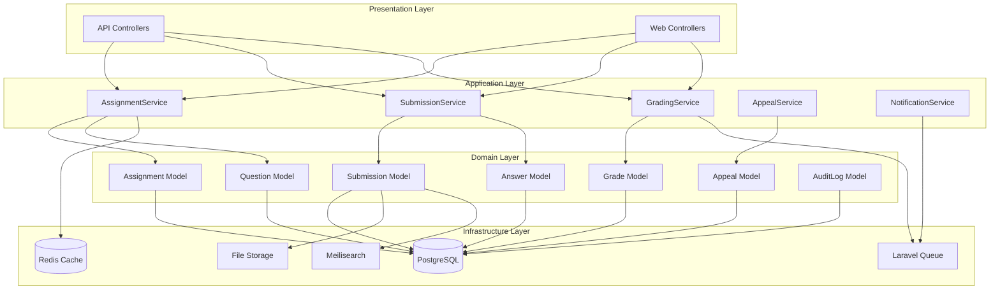

# Design Document: Assessment & Grading System

## Overview

The Assessment & Grading System is a comprehensive solution for managing assignments, submissions, and grading workflows in a Laravel-based Learning Management System. The system supports polymorphic assignment attachment, multiple question types with auto-grading capabilities, manual grading workflows, attempt management, and comprehensive audit logging.

### Important Implementation Notes

**Working with Existing Code**: This system will be built on top of existing migrations and API endpoints in the Modules/Learning and Modules/Grading modules. The implementation approach should:

1. **Refactor Existing Code**: Review and refactor existing Assignment, Submission, and Grade models and migrations
2. **Extend Existing Endpoints**: Improve and extend existing API endpoints rather than creating new ones from scratch
3. **Maintain Backward Compatibility**: Ensure changes don't break existing functionality
4. **Incremental Enhancement**: Add new features incrementally while improving existing code
5. **Database Schema Evolution**: Use migrations to evolve the existing schema rather than recreating tables

The design presented here represents the target architecture. Implementation tasks should focus on bridging the gap between current state and this target design through refactoring and enhancement.

### Key Design Principles

1. **Polymorphic Flexibility**: Assignments can be attached to Lessons, Units, or Courses using Laravel's polymorphic relationships
2. **State-Driven Workflow**: Submissions follow a clear state machine for predictable grading workflows
3. **Separation of Concerns**: Clear boundaries between assignment configuration, submission management, grading logic, and audit logging
4. **Performance First**: Eager loading, caching, background jobs, and database indexing for scalability
5. **Audit Trail**: Immutable logging of all critical operations for compliance and dispute resolution

## Architecture

### High-Level Architecture



### Module Structure

The system will be implemented within the existing Laravel Modules structure:

- **Modules/Learning**: Extended to include Question, Answer, and enhanced Assignment/Submission models
- **Modules/Grading**: Extended to include manual grading workflows, appeals, and grade recalculation
- **New: Modules/Auditing**: Dedicated module for audit logging (or extend existing if present)

### Design Patterns

1. **Repository Pattern**: All database access through repositories for testability
2. **Service Layer Pattern**: Business logic encapsulated in service classes
3. **State Pattern**: Submission state machine for workflow management
4. **Strategy Pattern**: Different grading strategies for question types
5. **Observer Pattern**: Laravel events for audit logging and notifications
6. **Queue Pattern**: Background jobs for expensive operations (recalculation, notifications)

## Components and Interfaces

### 1. Assignment Management Component

**Responsibility**: Manage assignment creation, configuration, and polymorphic attachment.

#### AssignmentService Interface

```php
interface AssignmentServiceInterface
{
    public function createAssignment(array $data): Assignment;
    public function updateAssignment(int $assignmentId, array $data): Assignment;
    public function duplicateAssignment(int $assignmentId): Assignment;
    public function attachToScope(int $assignmentId, string $scopeType, int $scopeId): void;
    public function getAssignmentWithQuestions(int $assignmentId): Assignment;
    public function checkPrerequisites(int $assignmentId, int $studentId): PrerequisiteCheckResult;
    public function grantOverride(int $assignmentId, int $studentId, string $overrideType, string $reason): void;
}
```

#### AssignmentRepository Interface

```php
interface AssignmentRepositoryInterface
{
    public function create(array $data): Assignment;
    public function update(int $id, array $data): Assignment;
    public function findWithQuestions(int $id): ?Assignment;
    public function findByScope(string $scopeType, int $scopeId): Collection;
    public function duplicate(int $id): Assignment;
}
```

#### Key Methods

- **createAssignment**: Validates and creates assignment with questions, settings, and polymorphic scope
- **checkPrerequisites**: Recursively checks prerequisites based on assignment scope hierarchy
- **grantOverride**: Allows instructors to override prerequisites, deadlines, or attempt limits for specific students

### 2. Question Management Component

**Responsibility**: Manage question creation, answer keys, and randomization.

#### QuestionService Interface

```php
interface QuestionServiceInterface
{
    public function createQuestion(int $assignmentId, array $data): Question;
    public function updateQuestion(int $questionId, array $data): Question;
    public function updateAnswerKey(int $questionId, array $answerKey): void;
    public function generateQuestionSet(int $assignmentId, ?int $seed = null): Collection;
}
```

#### QuestionRepository Interface

```php
interface QuestionRepositoryInterface
{
    public function create(array $data): Question;
    public function update(int $id, array $data): Question;
    public function findByAssignment(int $assignmentId): Collection;
    public function findRandomFromBank(int $bankId, int $count, int $seed): Collection;
}
```

#### Key Methods

- **updateAnswerKey**: Updates answer key and triggers grade recalculation job
- **generateQuestionSet**: Creates question set based on randomization settings (static, random order, or bank selection)

### 3. Submission Management Component

**Responsibility**: Handle submission lifecycle, attempt tracking, and deadline enforcement.

#### SubmissionService Interface

```php
interface SubmissionServiceInterface
{
    public function startSubmission(int $assignmentId, int $studentId): Submission;
    public function submitAnswers(int $submissionId, array $answers): Submission;
    public function checkDeadline(int $assignmentId, Carbon $submissionTime): DeadlineCheckResult;
    public function checkAttemptLimits(int $assignmentId, int $studentId): AttemptCheckResult;
    public function getHighestScoreSubmission(int $assignmentId, int $studentId): ?Submission;
    public function transitionState(int $submissionId, string $newState): void;
}
```

#### SubmissionRepository Interface

```php
interface SubmissionRepositoryInterface
{
    public function create(array $data): Submission;
    public function update(int $id, array $data): Submission;
    public function findWithAnswers(int $id): ?Submission;
    public function findByStudentAndAssignment(int $studentId, int $assignmentId): Collection;
    public function countAttempts(int $studentId, int $assignmentId): int;
    public function getLastSubmissionTime(int $studentId, int $assignmentId): ?Carbon;
    public function findHighestScore(int $studentId, int $assignmentId): ?Submission;
}
```

#### Key Methods

- **startSubmission**: Validates prerequisites, deadlines, and attempt limits before creating submission
- **submitAnswers**: Stores answers, triggers auto-grading, and transitions state
- **transitionState**: Implements state machine logic with validation

### 4. Grading Component

**Responsibility**: Auto-grading, manual grading workflows, and score calculation.

#### GradingService Interface

```php
interface GradingServiceInterface
{
    public function autoGrade(int $submissionId): void;
    public function manualGrade(int $submissionId, array $grades, ?string $feedback = null): Grade;
    public function saveDraftGrade(int $submissionId, array $partialGrades): void;
    public function calculateScore(int $submissionId): float;
    public function recalculateAfterAnswerKeyChange(int $questionId): void;
    public function overrideGrade(int $submissionId, float $score, string $reason): void;
    public function getGradingQueue(array $filters = []): Collection;
}
```

#### GradingRepository Interface

```php
interface GradingRepositoryInterface
{
    public function create(array $data): Grade;
    public function update(int $id, array $data): Grade;
    public function findBySubmission(int $submissionId): ?Grade;
    public function findPendingManualGrading(array $filters): Collection;
    public function saveDraft(int $submissionId, array $data): void;
}
```

#### Grading Strategy Interface

```php
interface GradingStrategyInterface
{
    public function grade(Question $question, Answer $answer): float;
    public function canAutoGrade(): bool;
}
```

#### Grading Strategy Implementations

1. **MultipleChoiceGradingStrategy**: Compares selected option to answer key (exact match)
2. **CheckboxGradingStrategy**: Compares selected options to answer key (set equality)
3. **ManualGradingStrategy**: Returns null, marks for manual grading
4. **FileUploadGradingStrategy**: Returns null, marks for manual grading

#### Key Methods

- **autoGrade**: Applies appropriate grading strategy to each question, calculates weighted score
- **calculateScore**: Computes weighted average: (Σ(score × weight)) / Σ(weight), normalized to 0-100
- **recalculateAfterAnswerKeyChange**: Queues background job to re-grade all affected submissions
- **getGradingQueue**: Returns submissions in "pending_manual_grading" state with filters

### 5. Appeal Management Component

**Responsibility**: Handle late submission appeals and instructor decisions.

#### AppealService Interface

```php
interface AppealServiceInterface
{
    public function submitAppeal(int $submissionId, string $reason, array $documents = []): Appeal;
    public function approveAppeal(int $appealId, int $instructorId): void;
    public function denyAppeal(int $appealId, int $instructorId, string $reason): void;
    public function getPendingAppeals(int $instructorId): Collection;
}
```

#### AppealRepository Interface

```php
interface AppealRepositoryInterface
{
    public function create(array $data): Appeal;
    public function update(int $id, array $data): Appeal;
    public function findPending(): Collection;
    public function findBySubmission(int $submissionId): ?Appeal;
}
```

#### Key Methods

- **submitAppeal**: Creates appeal record, uploads supporting documents, notifies instructors
- **approveAppeal**: Grants deadline extension, allows resubmission, logs decision
- **denyAppeal**: Notifies student with reason, logs decision

### 6. Audit Logging Component

**Responsibility**: Immutable logging of all critical operations.

#### AuditService Interface

```php
interface AuditServiceInterface
{
    public function logSubmissionCreated(Submission $submission): void;
    public function logStateTransition(Submission $submission, string $oldState, string $newState, int $actorId): void;
    public function logGrading(Grade $grade, int $instructorId): void;
    public function logAnswerKeyChange(Question $question, array $oldKey, array $newKey, int $instructorId): void;
    public function logGradeOverride(Grade $grade, float $oldScore, float $newScore, string $reason, int $instructorId): void;
    public function logAppealDecision(Appeal $appeal, string $decision, int $instructorId): void;
    public function logOverrideGrant(int $assignmentId, int $studentId, string $overrideType, string $reason, int $instructorId): void;
    public function search(array $filters): Collection;
}
```

#### AuditRepository Interface

```php
interface AuditRepositoryInterface
{
    public function create(array $data): AuditLog;
    public function search(array $filters): Collection;
}
```

#### Key Methods

- **All log methods**: Create immutable audit records with timestamp, actor, action, and context
- **search**: Provides filtering and searching capabilities for audit logs

### 7. Notification Component

**Responsibility**: Send notifications for grading events.

#### NotificationService Interface

```php
interface NotificationServiceInterface
{
    public function notifySubmissionGraded(Submission $submission): void;
    public function notifyGradesReleased(Collection $submissions): void;
    public function notifyManualGradingRequired(Submission $submission): void;
    public function notifyAppealSubmitted(Appeal $appeal): void;
    public function notifyAppealDecision(Appeal $appeal): void;
    public function notifyGradeRecalculated(Submission $submission, float $oldScore, float $newScore): void;
}
```

#### Key Methods

- **All notify methods**: Queue notification jobs for email and in-app delivery

## Data Models

### Assignment Model

```php
class Assignment extends Model
{
    // Polymorphic relationship
    public function assignable(): MorphTo;
    
    // Questions
    public function questions(): HasMany;
    
    // Submissions
    public function submissions(): HasMany;
    
    // Configuration
    protected $casts = [
        'deadline' => 'datetime',
        'tolerance_minutes' => 'integer',
        'max_attempts' => 'integer',
        'cooldown_minutes' => 'integer',
        'retake_enabled' => 'boolean',
        'review_mode' => 'string', // immediate, deferred, hidden
        'randomization_type' => 'string', // static, random, bank
        'question_bank_count' => 'integer',
    ];
}
```

### Question Model

```php
class Question extends Model
{
    // Assignment relationship
    public function assignment(): BelongsTo;
    
    // Answers
    public function answers(): HasMany;
    
    // Configuration
    protected $casts = [
        'type' => 'string', // multiple_choice, checkbox, essay, file_upload
        'content' => 'string',
        'options' => 'array', // For MCQ and checkbox
        'answer_key' => 'array',
        'weight' => 'float',
        'max_file_size' => 'integer', // bytes
        'allowed_file_types' => 'array',
        'order' => 'integer',
    ];
}
```

### Submission Model

```php
class Submission extends Model implements Searchable
{
    // Assignment relationship
    public function assignment(): BelongsTo;
    
    // Student relationship
    public function student(): BelongsTo;
    
    // Answers
    public function answers(): HasMany;
    
    // Grade
    public function grade(): HasOne;
    
    // Appeal
    public function appeal(): HasOne;
    
    // State machine
    protected $casts = [
        'state' => 'string', // in_progress, submitted, auto_graded, pending_manual_grading, graded, released
        'submitted_at' => 'datetime',
        'is_late' => 'boolean',
        'attempt_number' => 'integer',
        'score' => 'float',
        'question_set' => 'array', // IDs of questions presented
    ];
    
    // Scout searchable
    public function toSearchableArray(): array;
}
```

### Answer Model

```php
class Answer extends Model
{
    // Submission relationship
    public function submission(): BelongsTo;
    
    // Question relationship
    public function question(): BelongsTo;
    
    // Configuration
    protected $casts = [
        'content' => 'string', // For essay
        'selected_options' => 'array', // For MCQ and checkbox
        'file_paths' => 'array', // For file upload
        'score' => 'float',
        'is_auto_graded' => 'boolean',
        'feedback' => 'string',
    ];
}
```

### Grade Model

```php
class Grade extends Model
{
    // Submission relationship
    public function submission(): BelongsTo;
    
    // Grader relationship
    public function grader(): BelongsTo;
    
    // Configuration
    protected $casts = [
        'score' => 'float',
        'original_score' => 'float', // Before override
        'is_override' => 'boolean',
        'override_reason' => 'string',
        'feedback' => 'string',
        'is_draft' => 'boolean',
        'graded_at' => 'datetime',
        'released_at' => 'datetime',
    ];
}
```

### Appeal Model

```php
class Appeal extends Model
{
    // Submission relationship
    public function submission(): BelongsTo;
    
    // Student relationship
    public function student(): BelongsTo;
    
    // Reviewer relationship
    public function reviewer(): BelongsTo;
    
    // Configuration
    protected $casts = [
        'reason' => 'string',
        'supporting_documents' => 'array',
        'status' => 'string', // pending, approved, denied
        'decision_reason' => 'string',
        'submitted_at' => 'datetime',
        'decided_at' => 'datetime',
    ];
}
```

### AuditLog Model

```php
class AuditLog extends Model
{
    // No updates allowed - append only
    public $timestamps = false;
    
    // Configuration
    protected $casts = [
        'action' => 'string',
        'actor_id' => 'integer',
        'actor_type' => 'string',
        'subject_id' => 'integer',
        'subject_type' => 'string',
        'context' => 'array',
        'created_at' => 'datetime',
    ];
    
    // Prevent updates
    public static function boot()
    {
        parent::boot();
        static::updating(fn() => false);
        static::deleting(fn() => false);
    }
}
```

### Override Model

```php
class Override extends Model
{
    // Assignment relationship
    public function assignment(): BelongsTo;
    
    // Student relationship
    public function student(): BelongsTo;
    
    // Grantor relationship
    public function grantor(): BelongsTo;
    
    // Configuration
    protected $casts = [
        'type' => 'string', // prerequisite, deadline, attempts
        'reason' => 'string',
        'value' => 'array', // Flexible storage for override data
        'granted_at' => 'datetime',
        'expires_at' => 'datetime',
    ];
}
```

## Database Schema

### Key Indexes for Performance

```sql
-- Submissions table
CREATE INDEX idx_submissions_student_assignment ON submissions(student_id, assignment_id);
CREATE INDEX idx_submissions_state ON submissions(state);
CREATE INDEX idx_submissions_submitted_at ON submissions(submitted_at);
CREATE INDEX idx_submissions_score ON submissions(score);

-- Answers table
CREATE INDEX idx_answers_submission ON answers(submission_id);
CREATE INDEX idx_answers_question ON answers(question_id);

-- Grades table
CREATE INDEX idx_grades_submission ON grades(submission_id);
CREATE INDEX idx_grades_grader ON grades(grader_id);
CREATE INDEX idx_grades_released_at ON grades(released_at);

-- Appeals table
CREATE INDEX idx_appeals_status ON appeals(status);
CREATE INDEX idx_appeals_submission ON appeals(submission_id);

-- Audit logs table
CREATE INDEX idx_audit_logs_actor ON audit_logs(actor_id, actor_type);
CREATE INDEX idx_audit_logs_subject ON audit_logs(subject_id, subject_type);
CREATE INDEX idx_audit_logs_action ON audit_logs(action);
CREATE INDEX idx_audit_logs_created_at ON audit_logs(created_at);

-- Assignments table
CREATE INDEX idx_assignments_assignable ON assignments(assignable_type, assignable_id);
CREATE INDEX idx_assignments_deadline ON assignments(deadline);
```

## Correctness Properties

*A property is a characteristic or behavior that should hold true across all valid executions of a system—essentially, a formal statement about what the system should do. Properties serve as the bridge between human-readable specifications and machine-verifiable correctness guarantees.*


### Property 1: Assignment Polymorphic Attachment Uniqueness

*For any* Assignment, it SHALL have exactly one polymorphic relationship (attachable to Lesson, Unit, or Course, but not multiple or none).

**Validates: Requirements 1.1, 1.4**

### Property 2: Assignment Scope Retrieval Completeness

*For any* Assignment that is retrieved from the database, the attached scope (Lesson, Unit, or Course) SHALL be included in the result.

**Validates: Requirements 1.3**

### Property 3: Hierarchical Prerequisite Enforcement

*For any* Assignment with prerequisites, access SHALL be denied to students until all prerequisites within the appropriate scope hierarchy are completed (Lesson scope checks same Lesson, Unit scope checks Unit and its Lessons, Course scope checks entire Course).

**Validates: Requirements 2.1, 2.2, 2.3, 2.4**

### Property 4: Prerequisite Acyclicity

*For any* set of prerequisite relationships, there SHALL be no circular dependencies (no cycles in the prerequisite graph).

**Validates: Requirements 2.5**

### Property 5: Incomplete Prerequisites Reporting

*For any* student attempting to access an Assignment with unmet prerequisites, the system SHALL return a complete list of all incomplete prerequisite assignments.

**Validates: Requirements 2.6**

### Property 6: Multiple Choice Auto-Grading Correctness

*For any* Multiple Choice question and student answer, the auto-grading score SHALL be maximum points if the selected option matches the Answer_Key exactly, and zero otherwise.

**Validates: Requirements 3.5**

### Property 7: Checkbox Auto-Grading Set Equality

*For any* Checkbox question and student answer, the auto-grading score SHALL be maximum points if and only if the set of selected options equals the set of correct options in the Answer_Key.

**Validates: Requirements 3.6**

### Property 8: Manual Question Grading State

*For any* Essay or File Upload question that is answered, the submission SHALL transition to "pending_manual_grading" state (or remain in that state if other manual questions exist).

**Validates: Requirements 3.7**

### Property 9: Question Data Round-Trip

*For any* Question created with type, content, options, and Answer_Key, retrieving that question SHALL return all fields with values equal to the original input.

**Validates: Requirements 3.8**

### Property 10: Question Weight Validation

*For any* question creation or update, positive weight values SHALL be accepted, and non-positive weight values SHALL be rejected.

**Validates: Requirements 4.1**

### Property 11: Weighted Score Calculation Correctness

*For any* submission with answered questions, the calculated score SHALL equal (sum of (question_score × question_weight)) / (sum of question_weight), normalized to 0-100 scale.

**Validates: Requirements 4.2, 4.3, 4.4, 12.3**

### Property 12: Weight Change Triggers Recalculation

*For any* question weight update, all submissions containing that question SHALL have their scores recalculated using the new weight.

**Validates: Requirements 4.5**

### Property 13: Randomization Produces Unique Question Sets

*For any* Assignment with randomization enabled, multiple submission attempts SHALL generate different question sets (with high probability for random order, guaranteed for bank selection with different seeds).

**Validates: Requirements 5.4**

### Property 14: Grading Uses Submission Question Set

*For any* submission being graded, only questions from that submission's stored question_set SHALL be used in score calculation.

**Validates: Requirements 5.5**

### Property 15: Question Set Persistence

*For any* submission created with a question set, retrieving that submission SHALL return the same question set.

**Validates: Requirements 5.6**

### Property 16: Deadline Tolerance Window Acceptance

*For any* submission submitted after the deadline but within the tolerance window, the submission SHALL be accepted and marked with is_late = true.

**Validates: Requirements 6.3, 6.6**

### Property 17: Post-Tolerance Rejection

*For any* submission attempted after (deadline + tolerance), the submission SHALL be rejected.

**Validates: Requirements 6.4**

### Property 18: Maximum Attempts Enforcement

*For any* student who has reached the maximum number of attempts for an assignment, new submission attempts SHALL be rejected.

**Validates: Requirements 7.3, 7.6**

### Property 19: Cooldown Period Enforcement

*For any* student attempting a new submission before the cooldown period has elapsed since their last submission, the new attempt SHALL be rejected.

**Validates: Requirements 7.4**

### Property 20: Re-Take Mode Single Submission Limit

*For any* Assignment with re-take mode disabled, students SHALL be allowed exactly one submission (second submission attempt SHALL be rejected).

**Validates: Requirements 8.3**

### Property 21: Highest Score Selection

*For any* student with multiple submission attempts for an assignment, the final grade SHALL be the highest score across all attempts.

**Validates: Requirements 8.4, 22.1, 22.2**

### Property 22: New High Score Updates Final Grade

*For any* student who submits a new attempt with a score higher than previous attempts, the student's final grade for that assignment SHALL be updated to the new higher score.

**Validates: Requirements 22.4**

### Property 23: Assignment Score Change Cascades to Course Grade

*For any* assignment score change, the affected student's course grade SHALL be recalculated to reflect the new assignment score.

**Validates: Requirements 22.5**

### Property 24: Valid State Transitions Only

*For any* submission, state transitions SHALL only occur along valid paths in the state machine (in_progress → submitted → auto_graded/pending_manual_grading → graded → released), and invalid transitions SHALL be rejected.

**Validates: Requirements 9.1, 9.2, 9.3, 9.4, 9.5, 9.6, 9.7**

### Property 25: State Transition Audit Logging

*For any* submission state transition, an audit log entry SHALL be created with the old state, new state, timestamp, and actor ID.

**Validates: Requirements 9.8**

### Property 26: Manual Grading Queue Inclusion

*For any* submission in "pending_manual_grading" state, that submission SHALL appear in the grading queue.

**Validates: Requirements 10.1**

### Property 27: Grading Queue Chronological Ordering

*For any* grading queue query, results SHALL be ordered by submission timestamp in ascending order (oldest first).

**Validates: Requirements 10.2**

### Property 28: Grading Queue Filter Correctness

*For any* grading queue query with filters (assignment, student, date range), only submissions matching all specified filters SHALL be returned.

**Validates: Requirements 10.3**

### Property 29: Grading Queue Metadata Completeness

*For any* submission in the grading queue, the returned data SHALL include student name, assignment title, submission time, and list of questions requiring manual grading.

**Validates: Requirements 10.4**

### Property 30: Queue Return Capability

*For any* submission in "in_review" state, instructors SHALL be able to transition it back to "pending_manual_grading" state.

**Validates: Requirements 10.6**

### Property 31: Draft Grade Persistence Without State Change

*For any* submission with draft grades saved, the submission state SHALL remain unchanged, and the draft grades SHALL be retrievable.

**Validates: Requirements 11.1, 11.2**

### Property 32: Draft Grade Round-Trip

*For any* draft grades saved for a submission, resuming grading SHALL restore all previously saved draft scores and feedback.

**Validates: Requirements 11.3**

### Property 33: Finalization Requires Complete Grading

*For any* submission finalization attempt, if any required questions lack scores, the finalization SHALL be rejected.

**Validates: Requirements 11.4**

### Property 34: Release Blocked by Incomplete Grading

*For any* submission with incomplete grading (missing scores for required questions), grade release SHALL be prevented.

**Validates: Requirements 11.5**

### Property 35: Manual Question Score Range Validation

*For any* manual question grading, scores between 0 and the question's maximum points (inclusive) SHALL be accepted, and scores outside this range SHALL be rejected.

**Validates: Requirements 12.1**

### Property 36: Decimal Score Precision

*For any* manual question graded with a decimal score, the score SHALL be stored and retrieved with the same precision (no rounding errors).

**Validates: Requirements 12.2**

### Property 37: Feedback Persistence

*For any* question or submission graded with feedback, retrieving the grade SHALL return the feedback text unchanged.

**Validates: Requirements 13.1, 13.2**

### Property 38: Rich Text Feedback Support

*For any* feedback containing HTML markup, the HTML SHALL be stored and retrieved without sanitization or modification.

**Validates: Requirements 13.5**

### Property 39: Review Mode Visibility Rules

*For any* assignment with review mode "immediate", answers and feedback SHALL be visible immediately after submission; for "deferred", they SHALL be visible only after instructor release; for "hidden", they SHALL never be visible to students.

**Validates: Requirements 14.2, 14.3, 14.4**

### Property 40: Score Always Visible

*For any* graded submission, the final score SHALL be visible to the student regardless of review mode setting.

**Validates: Requirements 14.5**

### Property 41: Deferred Release Triggers Notification

*For any* assignment in deferred review mode, when the instructor releases grades, all affected students SHALL receive notifications.

**Validates: Requirements 14.6**

### Property 42: Answer Key Change Identifies Affected Submissions

*For any* Answer_Key update, the system SHALL identify all submissions that include the question with the changed answer key.

**Validates: Requirements 15.1**

### Property 43: Answer Key Change Triggers Auto-Grade Recalculation

*For any* Answer_Key update for an auto-gradable question, all affected submissions SHALL have their scores recalculated using the new answer key.

**Validates: Requirements 15.2, 15.3**

### Property 44: Answer Key Change Audit Logging

*For any* Answer_Key update, an audit log entry SHALL be created with the old key, new key, timestamp, and instructor ID.

**Validates: Requirements 15.4**

### Property 45: Recalculation Triggers Student Notification

*For any* submission with a score change due to answer key recalculation, the affected student SHALL receive a notification.

**Validates: Requirements 15.5**

### Property 46: Manual Grades Preserved During Recalculation

*For any* submission with manually graded questions, answer key changes to auto-graded questions SHALL NOT affect the manually graded question scores.

**Validates: Requirements 15.6**

### Property 47: Grade Override Requires Justification

*For any* grade override attempt, a non-empty reason SHALL be required, and override attempts without reasons SHALL be rejected.

**Validates: Requirements 16.2**

### Property 48: Original Score Preservation on Override

*For any* grade override, the original calculated score SHALL be preserved in a separate field while the override score becomes the displayed score.

**Validates: Requirements 16.3**

### Property 49: Grade Override Audit Logging

*For any* grade override, an audit log entry SHALL be created with the original score, override score, reason, timestamp, and instructor ID.

**Validates: Requirements 16.6**

### Property 50: Late Rejection Enables Appeal

*For any* submission rejected due to lateness (after deadline + tolerance), the student SHALL be able to create an appeal.

**Validates: Requirements 17.1**

### Property 51: Appeal Requires Reason

*For any* appeal submission attempt, a non-empty reason SHALL be required, and appeal attempts without reasons SHALL be rejected.

**Validates: Requirements 17.2**

### Property 52: Appeal Submission Triggers Instructor Notification

*For any* appeal created, all instructors for that assignment SHALL receive notifications.

**Validates: Requirements 17.3**

### Property 53: Approved Appeal Grants Submission Access

*For any* appeal that is approved, the student SHALL be able to submit the assignment despite the deadline having passed.

**Validates: Requirements 17.4**

### Property 54: Denied Appeal Triggers Student Notification

*For any* appeal that is denied, the student SHALL receive a notification including the denial reason.

**Validates: Requirements 17.5**

### Property 55: Appeal Decision Audit Logging

*For any* appeal decision (approved or denied), an audit log entry SHALL be created with the decision, reason, timestamp, and instructor ID.

**Validates: Requirements 17.6**

### Property 56: File Upload Type Validation

*For any* file upload to a File Upload question, if the file type is not in the allowed types list, the upload SHALL be rejected.

**Validates: Requirements 18.2**

### Property 57: File Upload Size Validation

*For any* file upload to a File Upload question, if the file size exceeds the configured maximum, the upload SHALL be rejected.

**Validates: Requirements 18.3**

### Property 58: File Storage and Retrieval

*For any* file uploaded to a File Upload question, the file SHALL be stored and retrievable via a secure download link.

**Validates: Requirements 18.4, 18.6**

### Property 59: File Access Authorization

*For any* uploaded file, only the student who uploaded it and instructors for that assignment SHALL be able to access the file; unauthorized users SHALL be denied access.

**Validates: Requirements 18.5**

### Property 60: Multiple File Upload Support

*For any* File Upload question configured to allow multiple files, students SHALL be able to upload multiple files, and all files SHALL be stored and retrievable.

**Validates: Requirements 18.7**

### Property 61: Expired File Marking

*For any* uploaded file where the retention period has expired, the file SHALL be marked for deletion.

**Validates: Requirements 19.2**

### Property 62: Metadata Preservation After File Deletion

*For any* file that is deleted due to retention policy, the file metadata (filename, size, upload date) SHALL remain in the database.

**Validates: Requirements 19.4**

### Property 63: Deleted File Access Error

*For any* attempt to access a deleted file, the system SHALL return an error message indicating the file has expired.

**Validates: Requirements 19.5**

### Property 64: Comprehensive Audit Logging

*For any* critical operation (submission creation, state transition, grading, answer key change, grade override, appeal decision), an audit log entry SHALL be created with action type, actor, subject, context, and timestamp.

**Validates: Requirements 20.1, 20.2, 20.3, 20.4, 20.5, 20.7**

### Property 65: Audit Log Immutability

*For any* audit log entry, update and delete operations SHALL be prevented (append-only).

**Validates: Requirements 20.6**

### Property 66: Event-Driven Notifications

*For any* grading event (submission graded, grades released, manual grading required, appeal submitted, appeal decided, grade recalculated), appropriate notifications SHALL be sent to affected users.

**Validates: Requirements 21.1, 21.2, 21.3, 21.4, 21.5, 21.6**

### Property 67: Auto-Grading Score Updates

*For any* question that is auto-graded, the submission score SHALL be updated immediately after the auto-grading completes.

**Validates: Requirements 23.1**

### Property 68: Partial Score Calculation

*For any* submission where all auto-gradable questions are graded but manual questions remain, a partial score SHALL be calculated and displayed based on the auto-graded questions.

**Validates: Requirements 23.2**

### Property 69: Manual Grading Score Updates

*For any* submission where manual grading is completed, the final score SHALL be updated immediately after the manual grading is finalized.

**Validates: Requirements 23.3**

### Property 70: Instructor Override Functionality

*For any* instructor, they SHALL be able to grant overrides for prerequisites, attempt limits, and deadlines for specific students, and each override SHALL require a reason.

**Validates: Requirements 24.1, 24.2, 24.3, 24.4**

### Property 71: Override Audit Logging

*For any* instructor override granted, an audit log entry SHALL be created with the override type, student, assignment, reason, timestamp, and instructor ID.

**Validates: Requirements 24.5**

### Property 72: Assignment Duplication Completeness

*For any* assignment duplication, the new assignment SHALL have all the same questions, settings, and configurations as the original, but with a different ID and no submissions.

**Validates: Requirements 25.1, 25.2, 25.4**

### Property 73: Bulk Grade Release

*For any* set of submissions selected for bulk grade release, all submissions SHALL transition to "released" state and students SHALL receive notifications.

**Validates: Requirements 26.2**

### Property 74: Bulk Feedback Application

*For any* set of submissions selected for bulk feedback, all submissions SHALL have the specified feedback applied.

**Validates: Requirements 26.4**

### Property 75: Bulk Operation Validation

*For any* bulk operation, if any selected submission is in an invalid state for that operation, the entire bulk operation SHALL be rejected with error details.

**Validates: Requirements 26.5**

### Property 76: Search Result Correctness

*For any* search query (by student name, email, state, score range, or date range), only submissions matching the search criteria SHALL be returned.

**Validates: Requirements 27.1, 27.2, 27.3, 27.4**

### Property 77: Search Result Metadata Completeness

*For any* search result, the returned submissions SHALL include all relevant metadata (student info, assignment info, score, state, submission time).

**Validates: Requirements 27.6**


## Error Handling

### Error Categories

1. **Validation Errors**: Invalid input data (e.g., negative weights, invalid file types)
2. **Business Rule Violations**: Prerequisite not met, deadline passed, attempt limit exceeded
3. **State Transition Errors**: Invalid state transitions in submission workflow
4. **Authorization Errors**: Unauthorized access to files, grades, or operations
5. **System Errors**: Database failures, file storage failures, queue failures

### Error Handling Strategy

#### Validation Errors

- **Detection**: Input validation at service layer before database operations
- **Response**: Return validation error with specific field errors
- **HTTP Status**: 422 Unprocessable Entity
- **Logging**: Log validation failures at INFO level
- **Example**: "Question weight must be a positive number"

#### Business Rule Violations

- **Detection**: Business logic checks in service methods
- **Response**: Return business rule violation with explanation
- **HTTP Status**: 400 Bad Request or 403 Forbidden
- **Logging**: Log business rule violations at INFO level
- **Example**: "Cannot submit: prerequisite assignment 'Introduction Quiz' not completed"

#### State Transition Errors

- **Detection**: State machine validation before transitions
- **Response**: Return state transition error with current state and attempted transition
- **HTTP Status**: 409 Conflict
- **Logging**: Log state transition errors at WARNING level
- **Example**: "Cannot transition from 'graded' to 'submitted'"

#### Authorization Errors

- **Detection**: Policy checks using Laravel's authorization system
- **Response**: Return authorization error
- **HTTP Status**: 403 Forbidden
- **Logging**: Log authorization failures at WARNING level
- **Example**: "You are not authorized to access this file"

#### System Errors

- **Detection**: Exception handling in service layer
- **Response**: Return generic error message (hide internal details)
- **HTTP Status**: 500 Internal Server Error
- **Logging**: Log full exception details at ERROR level
- **Recovery**: Use database transactions to rollback on failure
- **Example**: "An error occurred while processing your submission. Please try again."

### Retry and Recovery

1. **Background Jobs**: Use Laravel queue retry mechanism with exponential backoff
2. **Database Transactions**: Wrap multi-step operations in transactions
3. **File Upload Failures**: Allow re-upload without losing other submission data
4. **Idempotency**: Design operations to be safely retryable (e.g., grade recalculation)

### Error Monitoring

- **Logging**: Use Laravel's logging system with appropriate levels
- **Alerting**: Configure alerts for ERROR level logs
- **Metrics**: Track error rates by category
- **Audit Trail**: All errors affecting user data logged to audit log

## Testing Strategy

### Dual Testing Approach

The system requires both unit testing and property-based testing for comprehensive coverage:

- **Unit Tests**: Verify specific examples, edge cases, and error conditions
- **Property Tests**: Verify universal properties across all inputs
- **Integration Tests**: Verify component interactions and end-to-end workflows

Both approaches are complementary and necessary. Unit tests catch concrete bugs and document expected behavior through examples. Property tests verify general correctness across a wide range of inputs through randomization.

### Property-Based Testing Configuration

**Library Selection**: Use **Pest PHP with Pest Property Plugin** for property-based testing in PHP.

**Configuration Requirements**:
- Minimum 100 iterations per property test (due to randomization)
- Each property test must reference its design document property
- Tag format: `// Feature: assessment-grading-system, Property {number}: {property_text}`
- Each correctness property must be implemented by a SINGLE property-based test

**Example Property Test Structure**:

```php
use function Pest\Property\forAll;

test('Property 11: Weighted Score Calculation Correctness', function () {
    // Feature: assessment-grading-system, Property 11: Weighted Score Calculation Correctness
    
    forAll(
        'array<array{score: float, weight: float}>',
        function (array $questions) {
            // Arrange: Create submission with questions
            $submission = createSubmissionWithQuestions($questions);
            
            // Act: Calculate score
            $calculatedScore = $gradingService->calculateScore($submission->id);
            
            // Assert: Verify weighted average formula
            $expectedScore = calculateExpectedWeightedScore($questions);
            expect($calculatedScore)->toBe($expectedScore);
        }
    )->runs(100);
});
```

### Unit Testing Strategy

**Focus Areas for Unit Tests**:
1. **Specific Examples**: Concrete scenarios that demonstrate correct behavior
2. **Edge Cases**: Empty submissions, single question, all questions wrong, all questions right
3. **Error Conditions**: Invalid inputs, authorization failures, state transition errors
4. **Integration Points**: Service-repository interactions, event dispatching, notification sending

**Avoid Over-Testing**:
- Don't write many unit tests for scenarios covered by property tests
- Property tests handle covering lots of inputs through randomization
- Unit tests should focus on specific examples and edge cases

**Example Unit Test Structure**:

```php
test('submission with all correct MCQ answers receives 100% score', function () {
    // Arrange
    $assignment = Assignment::factory()->create();
    $questions = Question::factory()->multipleChoice()->count(5)->create([
        'assignment_id' => $assignment->id,
        'weight' => 1.0,
    ]);
    $submission = Submission::factory()->create(['assignment_id' => $assignment->id]);
    
    // Answer all questions correctly
    foreach ($questions as $question) {
        Answer::factory()->create([
            'submission_id' => $submission->id,
            'question_id' => $question->id,
            'selected_options' => [$question->answer_key[0]],
        ]);
    }
    
    // Act
    $gradingService->autoGrade($submission->id);
    
    // Assert
    expect($submission->fresh()->score)->toBe(100.0);
});

test('submission after deadline plus tolerance is rejected', function () {
    // Arrange
    $assignment = Assignment::factory()->create([
        'deadline' => now()->subHours(2),
        'tolerance_minutes' => 30,
    ]);
    $student = User::factory()->create();
    
    // Act & Assert
    expect(fn() => $submissionService->startSubmission($assignment->id, $student->id))
        ->toThrow(DeadlineExceededException::class);
});
```

### Integration Testing Strategy

**Focus Areas**:
1. **End-to-End Workflows**: Complete submission and grading workflows
2. **Event Handling**: Verify events trigger appropriate listeners
3. **Queue Jobs**: Verify background jobs are dispatched and executed
4. **Database Transactions**: Verify rollback on errors
5. **File Storage**: Verify file upload and retrieval workflows

**Example Integration Test**:

```php
test('complete submission and grading workflow', function () {
    // Arrange
    $instructor = User::factory()->instructor()->create();
    $student = User::factory()->student()->create();
    $assignment = Assignment::factory()->create([
        'assignable_type' => Lesson::class,
        'assignable_id' => Lesson::factory()->create()->id,
    ]);
    $mcqQuestion = Question::factory()->multipleChoice()->create(['assignment_id' => $assignment->id]);
    $essayQuestion = Question::factory()->essay()->create(['assignment_id' => $assignment->id]);
    
    // Act: Student starts submission
    $submission = $submissionService->startSubmission($assignment->id, $student->id);
    expect($submission->state)->toBe('in_progress');
    
    // Act: Student submits answers
    $submissionService->submitAnswers($submission->id, [
        $mcqQuestion->id => ['selected_options' => [$mcqQuestion->answer_key[0]]],
        $essayQuestion->id => ['content' => 'My essay answer'],
    ]);
    
    // Assert: Auto-grading completed for MCQ
    expect($submission->fresh()->state)->toBe('pending_manual_grading');
    $mcqAnswer = Answer::where('submission_id', $submission->id)
        ->where('question_id', $mcqQuestion->id)
        ->first();
    expect($mcqAnswer->is_auto_graded)->toBeTrue();
    
    // Act: Instructor grades essay
    $gradingService->manualGrade($submission->id, [
        $essayQuestion->id => ['score' => 8.5, 'feedback' => 'Good work'],
    ]);
    
    // Assert: Submission is graded
    expect($submission->fresh()->state)->toBe('graded');
    expect($submission->score)->toBeGreaterThan(0);
    
    // Assert: Audit logs created
    expect(AuditLog::where('subject_id', $submission->id)->count())->toBeGreaterThan(0);
});
```

### Test Coverage Goals

- **Unit Tests**: 80%+ code coverage
- **Property Tests**: All 77 correctness properties implemented
- **Integration Tests**: All major workflows covered
- **Performance Tests**: All performance requirements (28.1-28.10) validated

### Test Data Management

**Factories**: Use Laravel factories for all models with realistic data
**Seeders**: Create test seeders for common scenarios
**Database**: Use transactions to rollback after each test
**Files**: Use fake storage for file upload tests

### Continuous Integration

- Run all tests on every commit
- Run property tests with 100 iterations in CI
- Run performance tests on staging environment
- Block merges if tests fail or coverage drops

## Performance Optimization

### Database Optimization

1. **Indexing**: All frequently queried fields indexed (see Database Schema section)
2. **Eager Loading**: Use `with()` to prevent N+1 queries
3. **Query Optimization**: Use `select()` to load only needed columns
4. **Pagination**: Use cursor pagination for large result sets
5. **Database Transactions**: Group related operations for consistency

### Caching Strategy

1. **Assignment Configuration**: Cache assignment settings (TTL: 1 hour)
2. **Question Data**: Cache questions for assignments (TTL: 1 hour)
3. **Student Rosters**: Cache enrollment data (TTL: 30 minutes)
4. **Query Results**: Cache frequently accessed queries (TTL: 5 minutes)
5. **Cache Invalidation**: Clear relevant caches on data updates

### Background Processing

1. **Grade Recalculation**: Queue jobs for answer key changes
2. **Notifications**: Queue all notification sending
3. **File Processing**: Queue file validation and storage
4. **Bulk Operations**: Queue bulk grade release and feedback
5. **Queue Priority**: High priority for user-facing operations

### File Handling

1. **Streaming**: Stream files directly to storage without loading into memory
2. **Chunked Upload**: Support chunked uploads for large files
3. **CDN**: Use CDN for serving uploaded files (if applicable)
4. **Compression**: Compress files before storage (if applicable)

### Monitoring and Profiling

1. **Query Monitoring**: Use Laravel Telescope or similar for query analysis
2. **Performance Metrics**: Track response times for critical operations
3. **Queue Monitoring**: Monitor queue depth and job failures
4. **Cache Hit Rates**: Monitor cache effectiveness
5. **Alerting**: Alert on performance degradation

## Security Considerations

### Authentication and Authorization

1. **Role-Based Access**: Use Spatie Permission for role-based access control
2. **Policy Classes**: Define policies for all models
3. **API Authentication**: Use Laravel Sanctum for API authentication
4. **Session Security**: Secure session configuration

### Data Protection

1. **File Access Control**: Verify authorization before serving files
2. **SQL Injection**: Use Eloquent ORM and parameterized queries
3. **XSS Protection**: Sanitize user input, escape output
4. **CSRF Protection**: Enable CSRF protection for all forms
5. **Mass Assignment**: Use `$fillable` or `$guarded` on all models

### Audit and Compliance

1. **Immutable Logs**: Audit logs cannot be modified or deleted
2. **Data Retention**: Implement retention policies for compliance
3. **Privacy**: Handle student data according to privacy regulations
4. **Encryption**: Encrypt sensitive data at rest and in transit

## Deployment Considerations

### Database Migrations

1. **Incremental Migrations**: Create migrations for all schema changes
2. **Rollback Support**: Ensure migrations can be rolled back
3. **Data Migrations**: Separate data migrations from schema migrations
4. **Index Creation**: Create indexes in separate migrations for large tables

### Configuration

1. **Environment Variables**: Use `.env` for environment-specific configuration
2. **Feature Flags**: Use feature flags for gradual rollout
3. **Cache Configuration**: Configure Redis for caching and queues
4. **Queue Configuration**: Configure queue workers and supervisord

### Monitoring

1. **Application Monitoring**: Use Laravel Horizon for queue monitoring
2. **Error Tracking**: Use Sentry or similar for error tracking
3. **Performance Monitoring**: Use New Relic or similar for APM
4. **Log Aggregation**: Use ELK stack or similar for log analysis

## Future Enhancements

1. **Adaptive Testing**: Adjust question difficulty based on student performance
2. **Plagiarism Detection**: Integrate plagiarism detection for essay questions
3. **Video Submissions**: Support video file uploads for assignments
4. **Peer Review**: Enable peer review workflows for assignments
5. **Analytics Dashboard**: Provide instructors with detailed analytics
6. **Mobile App**: Native mobile app for students and instructors
7. **Offline Mode**: Support offline submission with sync when online
8. **AI-Assisted Grading**: Use AI to assist with essay grading
