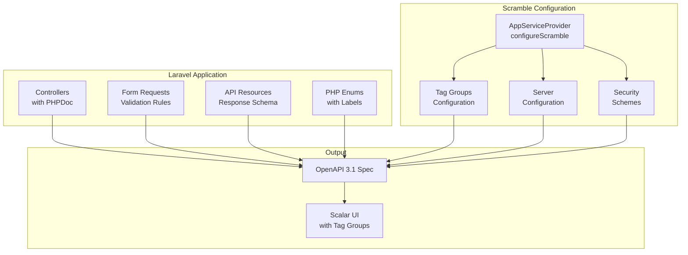

# Design Document: Scramble Documentation Enhancement

## Overview

Peningkatan kualitas dokumentasi API yang dihasilkan oleh Scramble melalui standarisasi PHPDoc annotations, implementasi API Resources untuk response schema, konfigurasi tag groups, dan penambahan example responses. Implementasi ini akan memanfaatkan fitur-fitur Scramble yang sudah ada dan menambahkan konfigurasi tambahan di AppServiceProvider.

## Architecture



## Components and Interfaces

### 1. Enhanced AppServiceProvider Configuration

```php
// app/Providers/AppServiceProvider.php

protected function configureScramble(): void
{
    Scramble::configure()
        ->routes(function (Route $route) {
            return Str::startsWith($route->uri, 'api/');
        });

    Scramble::configure()
        ->afterOpenApiGenerated(function (OpenApi $openApi) {
            $openApi->info->title = config('app.name', 'TA Prep LSP').' API';
            $openApi->info->description = $this->getApiDescription();

            // Add JWT Bearer authentication
            $openApi->secure(
                SecurityScheme::http('bearer', 'JWT')
            );

            // Add servers
            $this->configureServers($openApi);
            
            // Add tag groups
            $this->configureTagGroups($openApi);
        });
}

private function configureServers(OpenApi $openApi): void
{
    $openApi->servers = [
        new Server(config('app.url').'/api', 'Local Development'),
    ];
    
    if ($prodUrl = config('api.production_url')) {
        $openApi->servers[] = new Server($prodUrl, 'Production');
    }
}

private function configureTagGroups(OpenApi $openApi): void
{
    $openApi->addExtension('x-tagGroups', [
        [
            'name' => 'Autentikasi & Pengguna',
            'tags' => ['Autentikasi', 'Profil Pengguna', 'Manajemen Pengguna'],
        ],
        [
            'name' => 'Pembelajaran',
            'tags' => ['Skema & Kursus', 'Unit Kompetensi', 'Materi Pembelajaran', 'Progress Belajar'],
        ],
        [
            'name' => 'Tugas & Penilaian',
            'tags' => ['Tugas & Pengumpulan', 'Penilaian'],
        ],
        [
            'name' => 'Interaksi',
            'tags' => ['Forum Diskusi', 'Notifikasi', 'Gamifikasi'],
        ],
        [
            'name' => 'Konten & Data',
            'tags' => ['Konten & Berita', 'Data Master', 'Pencarian'],
        ],
        [
            'name' => 'Administrasi',
            'tags' => ['Pendaftaran Kursus', 'Laporan & Statistik'],
        ],
    ]);
}

private function getApiDescription(): string
{
    return <<<'MD'
## TA Prep LSP API

Platform Pembelajaran dan Sertifikasi LSP.

### Authentication

API ini menggunakan JWT Bearer Token untuk autentikasi. Untuk mendapatkan token:

1. Register atau Login melalui endpoint `/v1/auth/register` atau `/v1/auth/login`
2. Gunakan `access_token` dari response sebagai Bearer Token
3. Refresh token menggunakan `/v1/auth/refresh` sebelum expired

### Rate Limiting

- Default API: 60 requests per minute
- Auth endpoints: 10 requests per minute
- Enrollment endpoints: 5 requests per minute

### Response Format

Semua response menggunakan format standar:

```json
{
  "success": true,
  "message": "Operation successful",
  "data": { ... }
}
```

Error response:

```json
{
  "success": false,
  "message": "Error description",
  "errors": { ... }
}
```
MD;
}
```

### 2. PHPDoc Annotation Standards

```php
/**
 * @tags Autentikasi
 */
class AuthApiController extends Controller
{
    /**
     * @summary Login Pengguna
     * 
     * @description Autentikasi pengguna menggunakan email/username dan password.
     * Mengembalikan access token (JWT) dan refresh token untuk sesi.
     * 
     * **Rate Limit:** 10 requests per minute
     * 
     * @response 200 scenario="Success" {
     *   "success": true,
     *   "message": "Login berhasil.",
     *   "data": {
     *     "user": {"id": 1, "name": "John Doe", "email": "john@example.com"},
     *     "access_token": "eyJ0eXAiOiJKV1QiLCJhbGciOiJIUzI1NiJ9...",
     *     "refresh_token": "abc123def456...",
     *     "expires_in": 900
     *   }
     * }
     * @response 401 scenario="Invalid Credentials" {
     *   "success": false,
     *   "message": "Email atau password salah."
     * }
     * @response 422 scenario="Validation Error" {
     *   "success": false,
     *   "message": "Validasi gagal.",
     *   "errors": {"login": ["Field login wajib diisi."]}
     * }
     * @response 429 scenario="Rate Limited" {
     *   "success": false,
     *   "message": "Terlalu banyak percobaan. Silakan coba lagi dalam 60 detik."
     * }
     * 
     * @unauthenticated
     */
    public function login(LoginRequest $request): JsonResponse
    {
        // ...
    }
}
```

### 3. API Resource for Response Schema

```php
// app/Http/Resources/UserResource.php

namespace App\Http\Resources;

use Illuminate\Http\Request;
use Illuminate\Http\Resources\Json\JsonResource;

/**
 * @property int $id
 * @property string $name
 * @property string $email
 * @property string|null $username
 * @property string $status
 * @property string|null $avatar_url
 * @property \Carbon\Carbon|null $email_verified_at
 * @property \Carbon\Carbon $created_at
 */
class UserResource extends JsonResource
{
    public function toArray(Request $request): array
    {
        return [
            'id' => $this->id,
            'name' => $this->name,
            'email' => $this->email,
            'username' => $this->username,
            'status' => $this->status,
            'avatar_url' => $this->avatar_url,
            'email_verified_at' => $this->email_verified_at?->toISOString(),
            'created_at' => $this->created_at->toISOString(),
            'roles' => $this->whenLoaded('roles', fn() => $this->roles->pluck('name')),
        ];
    }
}
```

### 4. Enhanced Enum with Labels

```php
// Modules/Auth/app/Enums/UserStatus.php

namespace Modules\Auth\Enums;

enum UserStatus: string
{
    case Pending = 'pending';
    case Active = 'active';
    case Inactive = 'inactive';
    case Banned = 'banned';

    /**
     * Get human-readable label for the status.
     */
    public function label(): string
    {
        return match($this) {
            self::Pending => 'Menunggu Verifikasi',
            self::Active => 'Aktif',
            self::Inactive => 'Tidak Aktif',
            self::Banned => 'Diblokir',
        };
    }

    /**
     * Get description for documentation.
     */
    public function description(): string
    {
        return match($this) {
            self::Pending => 'User baru yang belum verifikasi email',
            self::Active => 'User aktif yang dapat mengakses semua fitur',
            self::Inactive => 'User yang dinonaktifkan sementara',
            self::Banned => 'User yang diblokir permanen',
        };
    }
}
```

### 5. Standard Response Wrapper

```php
// app/Support/ApiResponse.php (existing trait enhancement)

trait ApiResponse
{
    /**
     * Return success response.
     * 
     * @param array<string, mixed> $data
     * @return JsonResponse
     */
    protected function success(array $data, string $message = 'Success'): JsonResponse
    {
        return response()->json([
            'success' => true,
            'message' => $message,
            'data' => $data,
        ]);
    }

    /**
     * Return paginated response with meta.
     * 
     * @param \Illuminate\Pagination\LengthAwarePaginator $paginator
     * @return JsonResponse
     */
    protected function paginateResponse($paginator, string $message = 'Success'): JsonResponse
    {
        return response()->json([
            'success' => true,
            'message' => $message,
            'data' => $paginator->items(),
            'meta' => [
                'current_page' => $paginator->currentPage(),
                'last_page' => $paginator->lastPage(),
                'per_page' => $paginator->perPage(),
                'total' => $paginator->total(),
            ],
            'links' => [
                'first' => $paginator->url(1),
                'last' => $paginator->url($paginator->lastPage()),
                'prev' => $paginator->previousPageUrl(),
                'next' => $paginator->nextPageUrl(),
            ],
        ]);
    }
}
```

## Data Models

### Standard API Response Schema

```json
{
  "type": "object",
  "properties": {
    "success": {
      "type": "boolean",
      "description": "Indicates if the request was successful"
    },
    "message": {
      "type": "string",
      "description": "Human-readable message about the operation"
    },
    "data": {
      "type": "object",
      "description": "Response payload"
    }
  },
  "required": ["success", "message"]
}
```

### Paginated Response Schema

```json
{
  "type": "object",
  "properties": {
    "success": {"type": "boolean"},
    "message": {"type": "string"},
    "data": {"type": "array"},
    "meta": {
      "type": "object",
      "properties": {
        "current_page": {"type": "integer"},
        "last_page": {"type": "integer"},
        "per_page": {"type": "integer"},
        "total": {"type": "integer"}
      }
    },
    "links": {
      "type": "object",
      "properties": {
        "first": {"type": "string", "nullable": true},
        "last": {"type": "string", "nullable": true},
        "prev": {"type": "string", "nullable": true},
        "next": {"type": "string", "nullable": true}
      }
    }
  }
}
```


## Correctness Properties

*A property is a characteristic or behavior that should hold true across all valid executions of a system-essentially, a formal statement about what the system should do. Properties serve as the bridge between human-readable specifications and machine-verifiable correctness guarantees.*

### Property Reflection

After analyzing the acceptance criteria, the following properties were identified as testable and non-redundant:

**Consolidated Properties:**
- Properties 1.1-1.4 can be consolidated into a single "OpenAPI Schema Completeness" property
- Properties 4.1-4.3 can be consolidated into "Enum Documentation Consistency"
- Properties 5.1-5.3 can be consolidated into "Security Documentation Accuracy"

### Properties

**Property 1: OpenAPI Schema Completeness**

*For any* API endpoint that returns data, the generated OpenAPI specification SHALL contain a response schema that includes:
- All properties with their correct types
- Pagination meta/links for paginated endpoints
- Nested object structures for relationships
- Multiple response codes (success and error)

**Validates: Requirements 1.1, 1.2, 1.3, 1.4**

---

**Property 2: PHPDoc Summary Presence**

*For any* controller method that handles an API endpoint, the method SHALL have a @summary annotation present in its PHPDoc block.

**Validates: Requirements 2.1**

---

**Property 3: Query Parameter Documentation**

*For any* controller method that accesses query parameters via $request->input() or $request->query() without a Form Request, the method SHALL have corresponding parameter documentation in PHPDoc.

**Validates: Requirements 2.3**

---

**Property 4: Error Response Documentation**

*For any* controller method that can return error responses, the method SHALL have @response annotations documenting at least one error status code (401, 403, 404, or 422).

**Validates: Requirements 2.4**

---

**Property 5: Tag Groups Structure**

*For any* generated OpenAPI specification, the x-tagGroups extension SHALL contain all defined tags organized into functional groups.

**Validates: Requirements 3.1**

---

**Property 6: Enum Documentation Consistency**

*For any* enum field in request or response schemas, the OpenAPI specification SHALL:
- List all possible enum values
- Include descriptions when available in the PHP enum
- Use consistent formatting across all enum schemas

**Validates: Requirements 4.1, 4.2, 4.3**

---

**Property 7: Security Documentation Accuracy**

*For any* API endpoint:
- Public endpoints (no auth middleware) SHALL have `security: []` in the spec
- Authenticated endpoints SHALL reference the JWT Bearer security scheme
- Role-restricted endpoints SHALL indicate required roles in description

**Validates: Requirements 5.1, 5.2, 5.3**

---

**Property 8: Error Response Format Consistency**

*For any* documented error response, the response schema SHALL follow the standard format with `success: false`, `message`, and optional `errors` object.

**Validates: Requirements 6.2**

---

**Property 9: Server Configuration**

*For any* generated OpenAPI specification, the servers array SHALL contain at least one server entry with a valid URL.

**Validates: Requirements 7.1**

---

**Property 10: Query Builder Documentation**

*For any* endpoint that uses Spatie Query Builder or supports filtering/sorting:
- Endpoints with @allowedFilters SHALL have filter parameters documented
- Endpoints with @allowedSorts SHALL have sort parameter documented
- Endpoints with @allowedIncludes SHALL have include parameter documented
- Paginated endpoints SHALL have page and per_page parameters documented

**Validates: Requirements 8.1, 8.2, 8.3, 8.4, 8.5, 8.6**

---

## Error Handling

### Documentation Generation Errors

| Error Type | Handling Strategy |
|------------|-------------------|
| Missing @summary | Log warning, use method name as fallback |
| Invalid @response format | Log error, skip the response annotation |
| Enum without values | Log warning, document as string type |
| Missing Form Request | Infer parameters from method body where possible |

### Runtime Errors

| Error Type | Handling Strategy |
|------------|-------------------|
| OpenAPI generation failure | Return cached spec if available, log error |
| Invalid tag group config | Skip tag grouping, log warning |
| Server URL misconfiguration | Use default localhost URL |

## Testing Strategy

### Dual Testing Approach

This feature requires both unit tests and property-based tests to ensure comprehensive coverage.

### Property-Based Testing Library

**Library:** PHPUnit with custom assertions for OpenAPI spec validation

Since PHP doesn't have a mature property-based testing library like QuickCheck, we will use PHPUnit with:
- Custom assertions for OpenAPI schema validation
- Data providers for generating test cases
- Pest PHP for cleaner test syntax

### Unit Tests

Unit tests will cover:
1. AppServiceProvider configuration methods
2. API Resource transformations
3. Enum label/description methods
4. ApiResponse trait methods

### Property-Based Tests

Each correctness property will be implemented as a test that:
1. Generates the OpenAPI specification
2. Parses the JSON output
3. Validates the property holds for all relevant endpoints

**Test Configuration:**
- Minimum 1 iteration per endpoint (deterministic, not random)
- Tests run against the actual generated OpenAPI spec
- Each test tagged with property reference

**Test File Structure:**
```
tests/Feature/OpenApi/
├── SchemaCompletenessTest.php      # Property 1
├── PhpDocAnnotationsTest.php       # Properties 2, 3, 4
├── TagGroupsTest.php               # Property 5
├── EnumDocumentationTest.php       # Property 6
├── SecurityDocumentationTest.php   # Property 7
├── ErrorResponseFormatTest.php     # Property 8
└── ServerConfigurationTest.php     # Property 9
```

**Example Test Pattern:**
```php
/**
 * Feature: scramble-documentation-enhancement, Property 1: OpenAPI Schema Completeness
 * Validates: Requirements 1.1, 1.2, 1.3, 1.4
 */
test('all endpoints have complete response schemas', function () {
    $spec = generateOpenApiSpec();
    
    foreach ($spec['paths'] as $path => $methods) {
        foreach ($methods as $method => $operation) {
            expect($operation)->toHaveKey('responses');
            expect($operation['responses'])->toHaveKey('200');
            
            // Check for error responses
            $hasErrorResponse = array_intersect(
                array_keys($operation['responses']),
                ['401', '403', '404', '422']
            );
            expect($hasErrorResponse)->not->toBeEmpty();
        }
    }
});
```

### Test Execution

```bash
# Run all OpenAPI documentation tests
php artisan test --filter=OpenApi

# Run specific property test
php artisan test --filter=SchemaCompletenessTest
```
